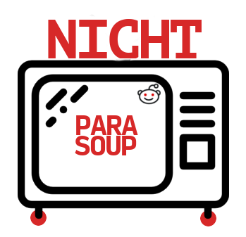

# nichtparasoup

---

:construction:  THIS FILE IS OUTDATED
:construction:  DUE TO A REWRITE

---

nichtparasoup is a hackspaces entertainment system.
It randomly displays images from
[reddit](https://reddit.com).

At our hackspace [k4cg](https://k4cg.org) we
use it since 2 years now. It turns out to be a very non-invasive way of
entertaining a crowd of nerds without having the noise and interruptions of
videos or other stuff.

Here is what it looks like in your browser

and even better, on a beamer in your local hackspace!

## demo

Visit [nicht.parasoup.de/demo/](http://nicht.parasoup.de/demo/) to try it!

## install, usage, config, etc 

see the [docs](docs)

## license

MIT - see the [`LICENSE`](LICENSE) file for details.

## credits

* see the [`AUTHORS`](AUTHORS) file for a list of essential contributors
* parts of the logo are taken
   from [Smashicons](https://www.flaticon.com/authors/smashicons)
   on [www.flaticon.com](https://www.flaticon.com/)
   are licensed [CC BY 3.0](https://creativecommons.org/licenses/by/3.0/)
